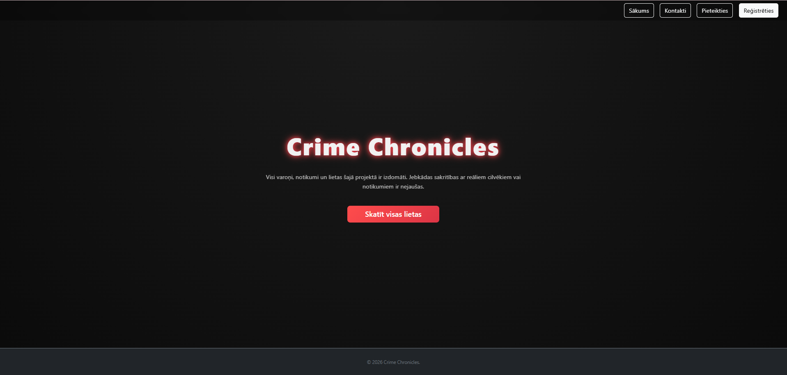
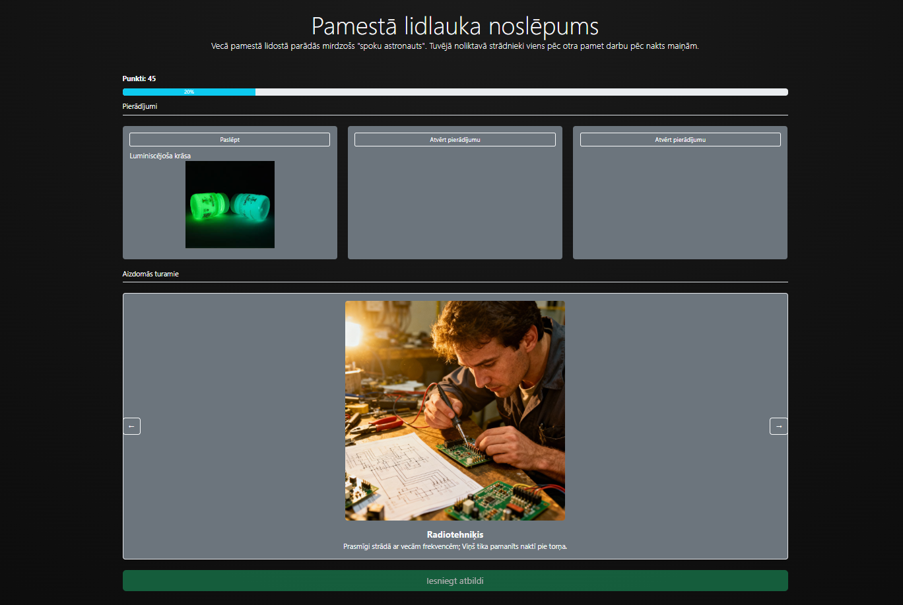
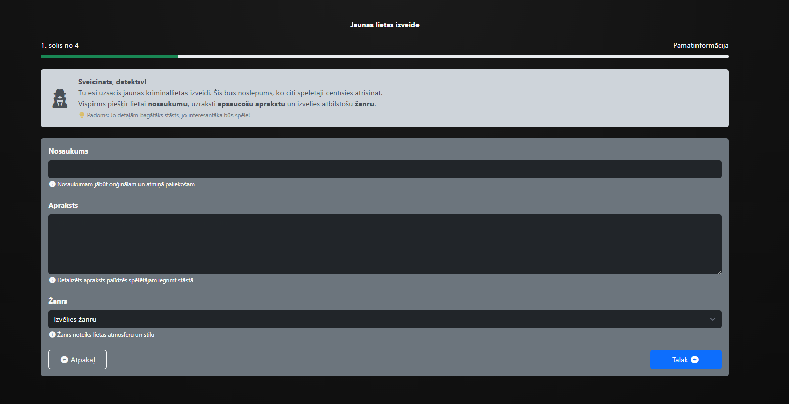
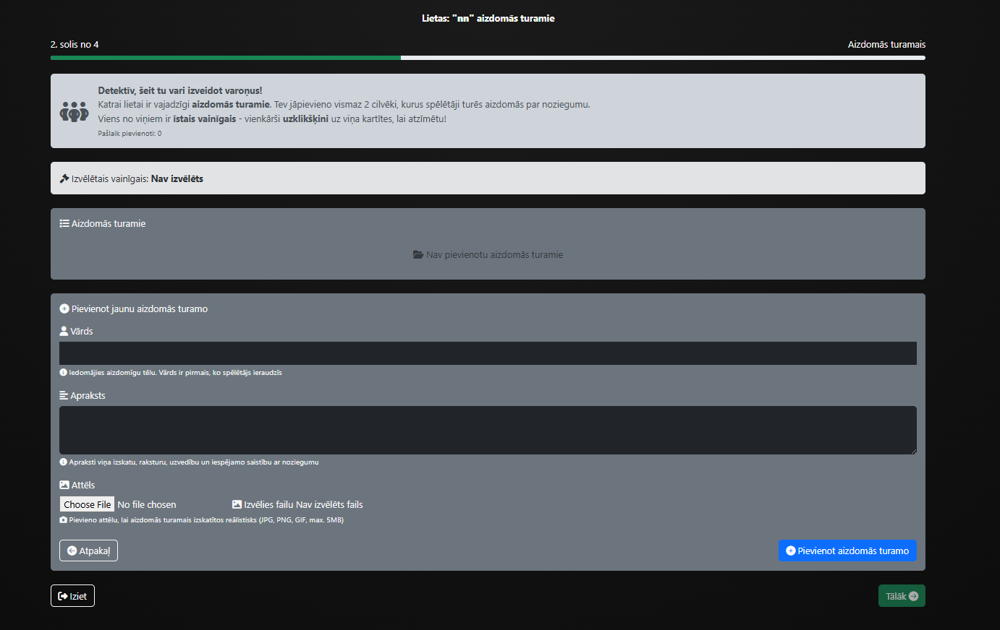
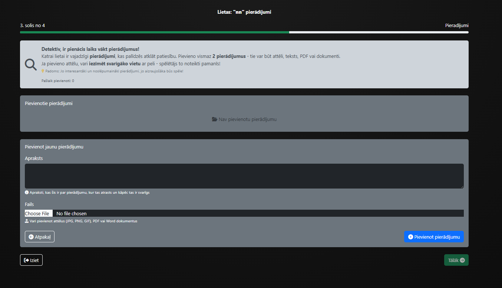
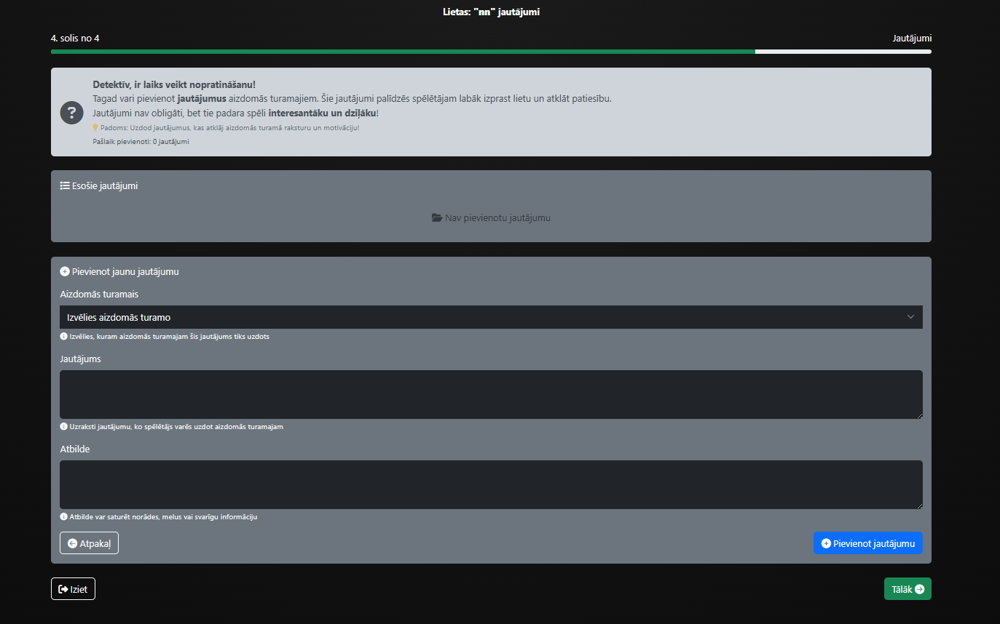
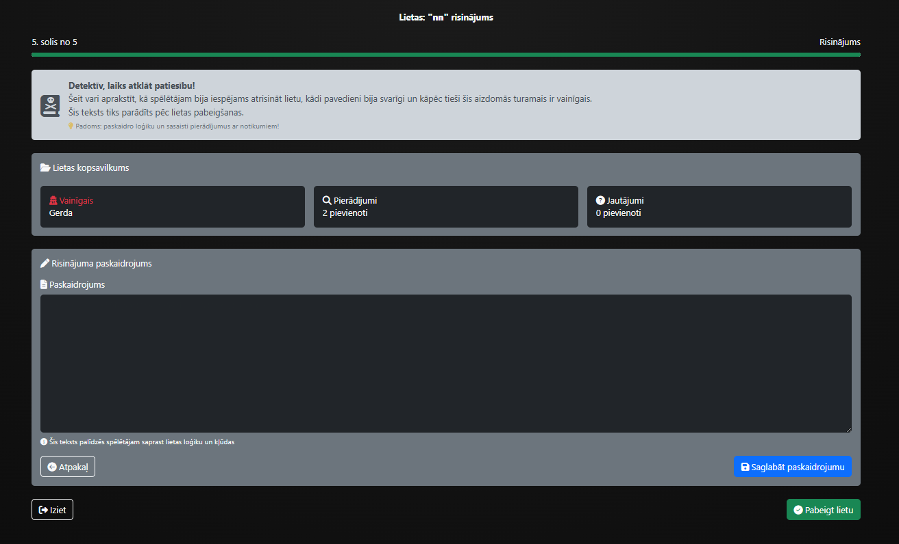
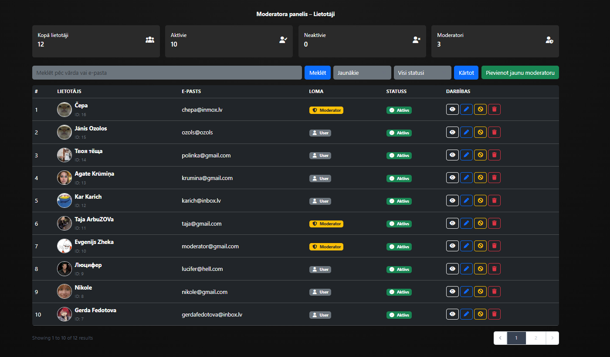

<h1 align="center">Crime Chronicles</h1>

## Par projektu

Crime Chronicles ir interaktīva tīmekļa platforma, kas paredzēta detektīvspēļu spēlēšanai un izveidei. Platformas galvenais mērķis ir nodrošināt lietotājiem iespēju iejusties izmeklētāja lomā, analizēt pierādījumus, nopratināt aizdomās turamos un atrisināt dažādas krimināllietas. 
Saite: 89.254.131.120:8009

Sistēma tika izstrādāta, izmantojot Laravel framework, HTML, CSS, JavaScript. Projekts balstās uz MVC arhitektūras principiem un nodrošina ērtu un interaktīvu lietotāja pieredzi.

Platformā lietotāji var reģistrēties, autorizēties un piekļūt detektīvspēļu sistēmai. Katrs lietotājs var izvēlēties sev interesējošu lietu, uzsākt izmeklēšanu un sekot savam progresam.

## Kā notiek izmeklēšana

Katras lietas laikā lietotājam ir pieejami dažādi pierādījumi, aizdomās turamie un jautājumi. Lietotāja uzdevums ir analizēt pieejamo informāciju un noteikt pareizo vainīgo.

Izmeklēšanas process ietver:

- pierādījumu apskati;
- aizdomās turamo analīzi;
- jautājumu izmantošanu nopratināšanas laikā;
- gala lēmuma pieņemšanu;
- punktu un progresa uzkrāšanu.

Sistēma saglabā lietotāja progresu, atvērto pierādījumu skaitu un sasniegtos rezultātus. Pēc veiksmīgas lietas atrisināšanas lietotājs var saņemt sasniegumus un papildus punktus.

## Lietu izveide

Platforma nodrošina iespēju lietotājiem izveidot savas detektīvspēles. Veidošanas laikā iespējams pievienot:

- lietas aprakstu;
- pierādījumus;
- aizdomās turamos;
- jautājumus;
- pareizo atbildi;
- paskaidrojumu par lietas atrisinājumu.

Pēc izveides lieta tiek nosūtīta moderatoram pārbaudei un apstiprināšanai.

## Galvenās funkcijas

- Lietotāju reģistrācija un autentifikācija;
- Detektīvspēļu spēlēšana;
- Lietotāja progresa sistēma;
- Punktu un sasniegumu sistēma;
- Lietu izveide un rediģēšana;
- Meklēšana, filtrēšana un šķirošana;
- Moderatoru un administratoru panelis;
- Darbību žurnālu sistēma;
- Lietotāju un satura moderācija.

## Sistēmas lomas

Sistēmā ir realizētas vairākas lietotāju lomas ar atšķirīgām piekļuves tiesībām.

**Lietotājs**
- var spēlēt lietas;
- apskatīt savu progresu;
- saņemt sasniegumus;
- izveidot savas lietas.

**Moderators**
- pārbauda lietotāju izveidotās lietas;
- apstiprina vai noraida saturu;
- pārvalda sistēmas saturu;
- var deaktivizēt lietotājus.

**Administrators**
- pārvalda moderatoru kontus;
- apskata darbību žurnālus;
- administrē sistēmas darbību.

## Tehnoloģijas

Projekta izstrādē tika izmantotas šādas tehnoloģijas:

- HTML;
- CSS;
- JavaScript;
- PHP;
- Laravel framework;
- Datubāze;
- Bootstrap;
- Font Awesome.

## Instalācija (lokālai izmantošanai)

Lai palaistu projektu savā datorā:

### 1. Klonē repozitoriju
git clone https://github.com/Gerda155/Crime-Chronicles.git
cd crime-chronicles

### 2. Kopē .env failu un konfigurē datubāzi
cp .env.example .env

### 3. Instalē PHP atkarības
composer install

### 4. Instalē JavaScript atkarības
npm install
npm run build

### 5. Ģenerē aplikācijas atslēgu
php artisan key:generate

### 6. Izveido datubāzes tabulas un aizpilda ar sākotnējiem datiem
php artisan migrate --seed

### 7. Palaid attīstības serveri
php artisan serve

## Secinājums

Crime Chronicles nodrošina interaktīvu vidi detektīvspēļu spēlēšanai un izveidei. Projekta izstrādes laikā tika realizēta lietotāju autentifikācija, lomu sistēma, progresa uzskaite, sasniegumu mehānika un satura moderācijas funkcionalitāte. Sistēma apvieno spēles elementus ar datubāzes un tīmekļa tehnoloģiju izmantošanu, radot pilnvērtīgu un funkcionālu platformu.
